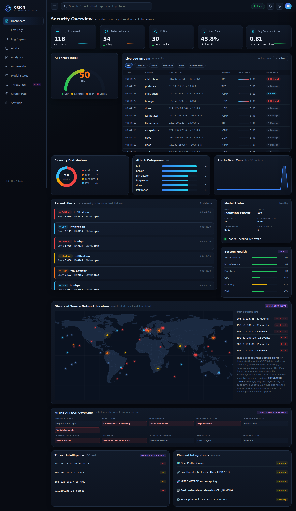
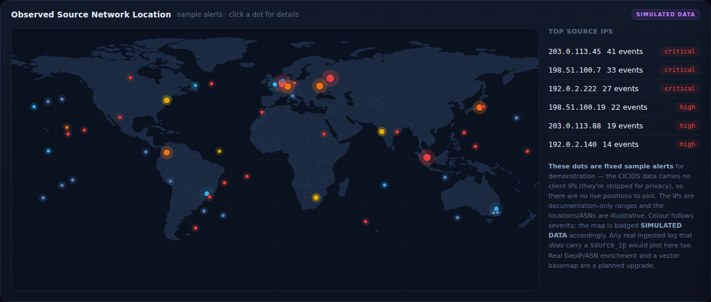
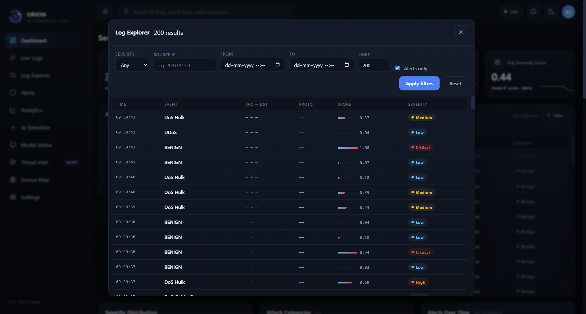
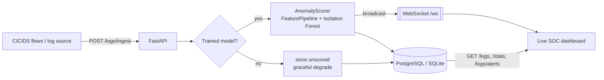

<p align="center">
  
</p>

<h1 align="center">Orion — AI-Driven SIEM Log Analyzer</h1>

<p align="center">
  Ingests network-flow logs, scores entries with flow features for anomalies using an Isolation Forest,<br/>
  and surfaces high-risk alerts through a REST API and a <b>real-time SOC dashboard</b>.
</p>

<p align="center">
  <a href="https://github.com/RushilJain96/ai-siem-log-analyzer/actions/workflows/ci.yml"></a>
  
  
  
</p>

Orion is a from-scratch **Security Information & Event Management (SIEM)** tool, built over ten days to understand how production platforms (Splunk, Wazuh, Cortex XDR) work under the hood. It's not just a model in a notebook — it treats the production concerns as first-class: a trust boundary on ingestion, a containerized Postgres deployment, a live WebSocket dashboard, an **integrity-verified model release** (SHA-256 verified before load), and a Blueprint-defined cloud deployment.

> 🔗 **Live demo:** [Open Orion SIEM →](https://orion-siem.onrender.com) · **API docs:** `/docs` · **Dashboard:** `/dashboard`

> ⚠️ **Portfolio-demo scope:** log ingestion and WebSocket authentication are not implemented yet. Do not submit real security telemetry or expose the API broadly until an ingestion API key is added.

---

## ✨ What it does

| | |
|---|---|
| 🧠 **Anomaly detection** | Isolation Forest scores each network flow; a tuned threshold turns scores into alerts, with `low`/`medium`/`high`/`critical` severity tiers. |
| ⚡ **Real-time dashboard** | Dependency-free SOC console (no build step) streaming live over WebSockets — KPIs, threat-index gauge, log stream, alerts, charts, a backend-backed log explorer, and a source-location map. |
| 🔍 **Honest explainability** | Each alert shows its *largest deviations from the benign baseline* (σ-distance) — a real analyst signal, labeled clearly as **not** SHAP-style model attribution. |
| 🔐 **Governed model release** | The deployed model is committed with a `model_card.json` (provenance + per-artifact SHA-256) and **verified before it's ever unpickled**; a mismatch fails startup closed. |
| 🐳 **Production-shaped** | 12-factor config, SQLite→Postgres by a single env var, Docker Compose, and a Render Blueprint (infra-as-code). |
| ✅ **Tested** | 142 pytest tests + GitHub Actions CI on every push. |

## 📸 Screenshots



| Source-location map | Log explorer |
|---|---|
|  |  |

## 🏗️ How it works



Ingest is a **sync** route (correct for sync SQLAlchemy); the WebSocket lives on the event loop. The broadcast is bridged across that boundary with `asyncio.run_coroutine_threadsafe`, fire-and-forget, so ingestion never blocks on dashboard delivery.

---

## 🚀 Quick start (local)

Requires **Python 3.12+**.

```bash
git clone https://github.com/RushilJain96/ai-siem-log-analyzer.git
cd ai-siem-log-analyzer

python -m venv .venv
source .venv/bin/activate          # Linux/macOS
# .venv\Scripts\Activate.ps1       # Windows PowerShell

pip install -r requirements-dev.txt
cp .env.example .env

uvicorn api.main:app --reload
```

Then open:
- **API docs** → http://localhost:8000/docs
- **Dashboard** → http://localhost:8000/dashboard/

Orion ships with an approved, integrity-verified model, so **detection works out of the box** — open the dashboard and start ingesting. (If the model is ever absent, the API still runs and degrades gracefully to *Model Status: unavailable*.)

## 🧠 Retrain the model

The current release includes an approved, integrity-verified model pair, so
you do not need CICIDS data just to run Orion locally.

The raw CICIDS dataset is required only when you want to reproduce training
or create a new reviewed model release. Raw CSV files remain untracked.

```bash
# 1. Download MachineLearningCSV.zip from
#    https://www.unb.ca/cic/datasets/ids-2017.html
#    → extract to ~/Downloads/MachineLearningCSV/MachineLearningCVE/  (or set CICIDS_DIR)

# 2. Build a class-aware sample (~58K rows)
python -m scripts.sample_cicids

# 3. Fit the preprocessor, then train + evaluate the detector
python -m scripts.fit_pipeline       # → model/preprocessor.pkl
python -m scripts.train_detector     # → model/isolation_forest.pkl + model/model_card.json

# 4. Start the API, then seed it (in a second terminal)
uvicorn api.main:app
python -m scripts.ingest_sample --count 5000
```

**Try live scoring** — POST a log with `features` and it comes back scored:

```bash
curl -X POST http://localhost:8000/logs/ingest \
  -H "Content-Type: application/json" \
  -d '{"event_time":"2026-07-11T12:00:00Z","source_ip":"10.0.0.5",
       "features":{"Flow Duration":40000000,"Flow Bytes/s":2,"SYN Flag Count":0}}'
# → { ..., "anomaly_score": 0.87, "is_alert": true }   (illustrative; your score depends on your model)
```

`features` accepts any subset of the 18 columns in `model.features.FEATURE_COLUMNS`; omitted ones are imputed from the fitted pipeline's medians. `is_alert`/`anomaly_score` are **server-set only** — a client that tries to send them gets a `422` (a deliberate trust boundary).

> 💡 The dashboard is best watched **live**: open `/dashboard/` *before* running `ingest_sample`, and watch logs, alerts, and charts animate in.

## 📡 API reference

| Method | Endpoint | Description |
|---|---|---|
| `POST` | `/logs/ingest` | Ingest a log; scores it if a model + `features` are present |
| `GET` | `/logs` | List logs with filters: `is_alert`, `severity`, `source_ip`, `start_time`, `end_time` |
| `GET` | `/logs/alerts` | Alerts only, most-anomalous first (triage view) |
| `GET` | `/stats` | Totals + `alerts_by_severity` breakdown |
| `GET` | `/model/info` | Live detector metadata (or `unavailable`) |
| `GET` | `/health` | Readiness probe (also proves the DB is reachable) |
| `WS` | `/ws` | Real-time feed — every stored log as `{"type":"log", ...}` |
| — | `/dashboard/` | The live SOC console · `/docs` for OpenAPI |

## 🖥️ The dashboard

**Real backend data:** KPIs, AI Threat Index gauge, live log stream + severity filters, alerts feed, severity/category/timeline charts, the **Log Explorer** (drill into any severity via `GET /logs`), **Model Status** (`GET /model/info`), and the AI Explanation drawer (real σ-deviations).

**Honestly labeled as not-real:**
- **`SIMULATED DATA` — the source-location map.** An IP is a network endpoint, not a place, and there's no GeoIP/ASN enrichment yet (CICIDS also strips client IPs). The basemap is real (Natural Earth boundaries baked to inline SVG — no third-party tiles), but a dot's *position* is a deterministic function of its IP. It's seeded with fixed sample alerts so it's never empty in a demo.
- **`DEMO` panels** — system health, MITRE ATT&CK coverage, threat-intel feed. Built to show the intended layout for future integration; the data is mock.

---

## 🐳 Run with Docker (Postgres)

```bash
docker compose up --build -d          # app + Postgres
docker compose logs api               # look for "integrity-verified" (or graceful skip)
curl.exe http://localhost:8000/health # {"status":"ok"}
docker compose down                   # add -v to also wipe the DB volume
```

Switching from SQLite to Postgres is a single `DATABASE_URL` change — no application code differs. Data persists in a named volume across restarts.

> On **Windows PowerShell**, use `curl.exe` (plain `curl` is an alias for `Invoke-WebRequest`). On macOS/Linux, use `curl`.

## ☁️ Deploy to Render

Orion deploys as a Docker web service + managed Postgres, declared as infra-as-code in [`render.yaml`](render.yaml). Render is a suitable fit because this project uses a long-running FastAPI service with WebSocket connections and PostgreSQL.

1. **Commit the approved model** (it ships *inside* the image): after `train_detector`, commit `model/preprocessor.pkl`, `model/isolation_forest.pkl`, and `model/model_card.json`. The `.gitignore`/`.dockerignore` allowlist permits exactly these; `.gitattributes` marks them `binary` so their bytes (and thus their SHA-256) survive a Windows→Linux checkout.
2. **Push**, then in Render: **New → Blueprint** → your repo → Apply. It creates the web service + Postgres (both `region: singapore`) and wires `DATABASE_URL` in.
3. Watch the logs for `Anomaly detector loaded and integrity-verified`, then open `https://<service>.onrender.com/dashboard`.

`MODEL_REQUIRED=true` is set on Render, so a build that somehow shipped without the model **fails loudly** instead of running a detector with no model. (Free tier sleeps after ~15 min idle → first hit cold-starts in ~30–60s.)

---

## 📊 Model & evaluation

Isolation Forest, trained on **benign flows only** (all attack rows held out for evaluation), with the alert threshold tuned to **maximize recall under a 5% false-positive budget**.

| Metric | Value |
|---|---|
| Precision | **0.908** |
| Recall | **0.349** |
| F1 | 0.504 |
| FPR | 0.050 |
| Adjusted precision (prevalence-corrected) | 0.631 |

Detection is **uneven by attack type** — strong on volumetric floods and infiltration, near-blind on port scans and credential brute-forcing, because those need cross-flow/payload signals the flow-shape-only features can't provide (not just a different threshold).

<details>
<summary><b>Per-attack-type recall (full table)</b></summary>

| Attack type | Rows | Recall |
|---|---|---|
| Heartbleed | 11 (small) | 100.0% |
| Infiltration | 36 | 80.6% |
| DoS Hulk | 4,620 | 67.6% |
| DDoS | 2,561 | 41.5% |
| DoS GoldenEye | 300 | 27.0% |
| DoS Slowhttptest | 300 | 26.3% |
| DoS slowloris | 300 | 22.3% |
| Bot | 300 | 3.0% |
| Web Attack XSS | 300 | 1.7% |
| Web Attack Brute Force | 300 | 1.0% |
| PortScan | 3,179 | 0.2% |
| SSH-Patator | 299 | 0.0% |
| FTP-Patator | 300 | 0.0% |
| Web Attack SQL Injection | 21 (small) | 0.0% |

An F1-maximizing threshold was tried and **rejected**: 95% recall at a 47% false-positive rate is unusable (alert fatigue). `contamination=0.01` is sklearn's training-time noise allowance, *not* real-world prevalence — and it turns out not to affect the tuned operating point.
</details>

📄 Full methodology and reasoning: **[docs/model-evaluation.md](docs/model-evaluation.md)**.

### 🔐 Model integrity (how the release is governed)

The two approved artifacts are the *only* `.pkl` files committed, baked into the image, and described by `model/model_card.json` — a release record with provenance (version, dataset + its SHA-256, feature names, runtime versions), the full evaluation, and **each artifact's SHA-256**. At startup, `model/artifact_integrity.py` hashes the files and compares them to the card **before `joblib.load` ever runs** (unpickling untrusted bytes is an RCE risk). A partial release, hash mismatch, missing required release file, or malformed card fails closed. A completely absent model remains an allowed local-development fallback; Render sets MODEL_REQUIRED=true and fails startup instead. It protects against corruption, model/card drift, and a swapped artifact; it does *not* claim to stop an attacker who can edit both the model and the card in the repo — that's the signed-release tier, noted below.

---

## 🗂️ Project structure

```
api/          FastAPI app — main.py (lifespan, routes), realtime.py (WS bridge), routes/
core/         config.py (12-factor settings), logging.py (structured JSON)
db/           SQLAlchemy 2.0 — database.py, models.py, crud.py
model/        features.py · detector.py · inference.py · severity.py
              artifact_integrity.py (card + verify) · model_card.json (release record)
dashboard/    Live SOC dashboard — dependency-free HTML/CSS/JS + baked worldmap.js
scripts/      sample_cicids.py · fit_pipeline.py · train_detector.py · ingest_sample.py
tests/        142 pytest tests (synthetic data only — CI needs no real CSV)
Dockerfile · docker-compose.yml · render.yaml   # local + cloud deploy
```

All configuration flows through `core/config.py`; nothing else touches `os.environ`. That single seam is what made the SQLite→Postgres swap a one-line change.

## 🛠️ Tech stack

- **Backend:** FastAPI (ASGI), built on Starlette
- **Real-time:** WebSockets (FastAPI/Starlette native), sync→async broadcast bridge
- **Frontend:** dependency-free HTML/CSS/JS (no build step, no framework), dark SOC theme
- **ML:** scikit-learn (Isolation Forest), joblib-persisted artifacts with SHA-256 integrity verification
- **ORM:** SQLAlchemy 2.0 with the typed `Mapped[T]` / `mapped_column()` syntax
- **Validation:** Pydantic v2
- **Database:** SQLite (local dev), PostgreSQL (via Docker Compose / Render)
- **Containers & deploy:** Docker + Docker Compose (app + Postgres), Render Blueprint (infra-as-code)
- **Testing:** pytest with FastAPI's TestClient (httpx-backed)
- **CI:** GitHub Actions running pytest on every push

## ⚠️ Limitations

- **Severity = anomaly magnitude, not proven maliciousness.** An unusual-but-legitimate flow (e.g. a large file transfer) can score `critical` right next to a real attack — the model flags "statistically weird," not "malicious." Observed directly in testing. An analyst feedback loop is the v2 fix.
- **No authentication** on any endpoint (or the WebSocket). Threat model is "trusted localhost." Auth is a v2 item.
- **CICIDS ML CSVs strip client IPs**, so `source_ip` is `null` for ingested rows — hence the simulated map, and no cross-flow features (which would help the PortScan/brute-force blind spot).

<details>
<summary><b>More limitations (dataset quirks, persistence, dashboard scope)</b></summary>

- SQLite strips timezone info on `DateTime(timezone=True)`; `event_time` round-trips naive locally. **Resolved on Postgres.**
- Per-flow timestamps aren't in the CICIDS ML CSVs; `event_time` is ingestion wall-clock.
- CICIDS Web Attack labels contain a `�` from a CP1252→UTF-8 mismatch in the source data (harmless for binary classification).
- Feature selection is manual (18 of 78 columns); `Destination Port` is excluded to prevent trivial port→attack learning.
- The pipeline drops inf/NaN rows at fit time (~0.2% of benign) but *imputes* at transform time so single-row inference never fails.
- `Detector.save()` and `FeaturePipeline.save()` use two different persistence conventions — not yet reconciled (backlog).
- `WS /ws` broadcasts **every** log to **every** client with no per-client filtering or auth — fine at demo rates on localhost; production would throttle/split channels and gate the socket.
</details>

## 🗺️ Roadmap

**North star:** turn Orion from CICIDS *replay* into a real SIEM — a lightweight **agent that collects logs from live systems** (host + network telemetry), reshapes them into the `/logs/ingest` schema, and scores them in real time, the way a production SIEM does. The ingestion schema was built to support this; the collector is the missing piece.

Toward that, and beyond:

- 🛰️ **Real log-collection agent** — a collector/agent that streams live system & network events into the API, replacing CICIDS replay *(flagship goal)*
- 🔁 **Analyst feedback loop** — mark alerts as false positives to re-rank scoring, so benign outliers (large legitimate transfers) stop surfacing as critical
- 🔐 **Authentication** — secure the REST API and the `WS /ws` socket (currently trusted-localhost only)
- 🧬 **Cross-flow / per-source features** — connection rate, distinct-port counts in a time window, to close the PortScan / brute-force blind spot (needs a dataset that keeps source IPs)
- 🤖 **Autoencoder detector** — a neural alternative to benchmark against the Isolation Forest
- 🧩 **Alert correlation** — group related alerts into incidents
- 🎯 **Real MITRE ATT&CK mapping** — a technique-mapping engine in place of the current demo lookup
- 🌍 **Real GeoIP/ASN enrichment + vector basemap (MapLibre)** — make the source-location map real
- 💡 **SHAP-style attribution** — true per-prediction model explanation vs. today's honest baseline-deviation proxy
- ⚙️ **Scale & ops** — RabbitMQ for high-throughput async ingestion, Alembic migrations, and signed release manifests for artifacts (the supply-chain tier beyond in-repo hashes)

<details>
<summary><b>🛠️ How it was built (the 10-day journey)</b></summary>

Built incrementally, one concern per day, each shipped with tests:

1. **Foundation** — FastAPI service, structured logging, CI.
2. **Persistence** — SQLAlchemy 2.0 models, ingest → list → stats.
3. **Feature pipeline** — 18 flow-shape features, benign-only StandardScaler (no leakage), median imputation for live rows.
4. **Detector + evaluation** — Isolation Forest wrapper, calibrated scores, threshold tuning, per-attack recall; fixed a sampler bug that had silently starved rare attack classes.
5. **Live detection** — `AnomalyScorer` wired into ingest via dependency injection; closed the `is_alert`/`anomaly_score` trust-boundary gap.
6. **Alert triage** — severity tiers (computed, never stored), composable filters, `/logs/alerts`, per-severity stats.
7. **Indexing** — indexed `anomaly_score` by its actual query pattern.
8. **Containerized Postgres** — Dockerfile + Compose; SQLite→Postgres by one `DATABASE_URL`; verified persistence + timezone round-trips.
9. **Real-time dashboard** — WebSocket `ConnectionManager` + sync→async bridge; the full dependency-free SOC console, log explorer, and real-boundary source map.
10. **Cloud deploy + model governance** — Render Blueprint, `$PORT`/`postgres://` fixes, and the integrity-verified model release (`model_card.json` + verify-before-load + `MODEL_REQUIRED` fail-closed).
</details>

## 📄 License

[MIT](LICENSE).
